# 人間向け 仕様駆動開発（SDD）ガイド

## 1. この資料の目的

この資料は、開発経験が少ない業務担当者・企画担当者が、AI と一緒に仕様駆動開発を進めるための
実務ガイドです。

次のことが分かるように説明します。

- 開発開始前に人間が準備するもの
- 機能仕様とデザインを、どのように1つの正本へ統合するか
- 各フェーズで人間と AI がそれぞれ何をするか
- 何を確認して承認・差戻しすればよいか
- 承認後に仕様変更が発生した場合の扱い

AI に対する詳細な実行ルールの正本は `.cursor/rules/sdd-workflow.mdc` です。本資料と食い違う場合は
実行ルールを優先し、食い違いを人間へ報告します。

## 2. この開発方法の全体像

本プロジェクトでは、いきなり実装を始めません。次の順序で進めます。

1. 開発入力を準備する
2. フェーズ1「仕様整理」で、入力資料を統合した要件定義を作る
3. フェーズ2「設計」で、要件をどのように実現するか決める
4. フェーズ3「テスト設計」で、何をもって完成と判断するか決める
5. フェーズ4「実装・テスト」で、承認済みの設計とテスト計画を実装する

フェーズ1〜3は、各フェーズの成果物を人間が承認するまで次へ進みません。この停止点を
「承認ゲート」と呼びます。

この進め方の目的は、人間が判断しやすい段階で認識違いを見つけ、実装後の大きな手戻りを減らすことです。

### 開発フロー図

時間は左から右へ進みます。各列が1つのフェーズです。
青は人間の作業、紫はAIの作業、橙は人間による承認ゲートを表します。

```mermaid
flowchart LR
    subgraph P0["フェーズ0<br/>開発入力の準備"]
        direction TB
        H00["人間<br/>機能specを準備"]:::human
        H01{"人間<br/>designの位置づけ"}:::human
        H02["canonical<br/>採用済み画面を準備"]:::human
        H03["reference<br/>参考資料・参考範囲を準備"]:::human
        H04["none<br/>design資料なし"]:::human
        A00["AI<br/>design_modeと参照元を記録"]:::ai

        H00 --> H01
        H01 --> H02
        H01 --> H03
        H01 --> H04
        H02 --> A00
        H03 --> A00
        H04 --> A00
    end

    subgraph P1["フェーズ1<br/>仕様整理"]
        direction TB
        A10["AI<br/>資料統合・差分と不明点の整理"]:::ai
        H10["人間<br/>質問への回答・業務判断"]:::human
        A11["AI<br/>要件確定案・独立レビュー"]:::ai
        G1{"人間<br/>承認 / 差戻し"}:::gate
        A12["AI<br/>status・履歴更新・コミット"]:::ai

        A10 --> H10 --> A11 --> G1
        G1 -- "承認" --> A12
        G1 -. "差戻し" .-> A10
    end

    subgraph P2["フェーズ2<br/>設計"]
        direction TB
        A20["AI<br/>Laravel設計・影響調査<br/>design変換方針・独立レビュー"]:::ai
        H20["人間<br/>業務・画面・影響範囲を確認"]:::human
        G2{"人間<br/>承認 / 差戻し"}:::gate
        A21["AI<br/>status・履歴更新・コミット"]:::ai

        A20 --> H20 --> G2
        G2 -- "承認" --> A21
        G2 -. "差戻し" .-> A20
    end

    subgraph P3["フェーズ3<br/>テスト設計"]
        direction TB
        A30["AI<br/>テスト計画・lint<br/>独立レビュー"]:::ai
        H30["人間<br/>業務シナリオ・期待結果を確認"]:::human
        G3{"人間<br/>承認 / 差戻し"}:::gate
        A31["AI<br/>status・履歴更新・コミット"]:::ai

        A30 --> H30 --> G3
        G3 -- "承認" --> A31
        G3 -. "差戻し" .-> A30
    end

    subgraph P4["フェーズ4<br/>実装・テスト"]
        direction TB
        A40["AI<br/>実装・PHPUnit・Vitest・Playwright"]:::ai
        A41["AI<br/>Test ID突合・画面比較・完了報告"]:::ai
        H40["人間<br/>完了報告・実画面を受け入れ確認"]:::human
        G4{"人間<br/>期待どおりか"}:::gate
        DONE["完了"]:::done

        A40 --> A41 --> H40 --> G4
        G4 -- "問題なし" --> DONE
        G4 -. "実装不具合" .-> A40
    end

    A00 --> A10
    A12 --> A20
    A21 --> A30
    A31 --> A40

    classDef human fill:#e8f1ff,stroke:#2563eb,color:#172554;
    classDef ai fill:#f3e8ff,stroke:#7e22ce,color:#3b0764;
    classDef gate fill:#fff7ed,stroke:#ea580c,color:#431407;
    classDef done fill:#ecfdf5,stroke:#059669,color:#064e3b;
```



差戻しでは同じフェーズを修正します。図では省略していますが、承認済みの内容そのものを変える
必要がある場合の手順は、本文「承認後に変更が必要になった場合」を参照してください。

## 3. 正本と開発入力の考え方

### 3.1 開発開始時に用意する一次資料

機能specは必須です。design資料は、目的に応じて「画面正本」「参考」「なし」から位置づけを選びます。
バックエンド処理、バッチ、設定変更など、画面設計が不要な機能ではdesign資料は必要ありません。

#### A. 機能spec

GitHub Issue や Markdown で用意します。主に次の内容の元資料です。

- なぜ作るのか、誰のための機能か
- 対象範囲と対象外
- 業務ルール
- 利用者と権限
- 正常時・異常時の動き
- 入力制限とエラー
- データや状態の変化
- 性能、セキュリティ、ログなどの非機能要件

#### B. design資料（画面の新設・変更がある場合）

画面モック、スクリーンショット、デザイン説明 Markdown、操作可能なプロトタイプなどで用意します。
主に次の内容の元資料です。

- 画面一覧と画面構成
- 画面遷移と操作導線
- 表示項目、入力項目、ボタン、文言
- ロールや状態による表示の違い
- レイアウト、色、余白、文字、レスポンシブ表示
- ローディング、空表示、エラー表示、確認画面などの UI 状態

design資料を用意するときは、次のどれとして扱うかを開始時に決めます。

| 位置づけ | `design_mode` | 用途 | 実装・完了基準 |
|---------|---------------|------|---------------|
| 画面正本 | `canonical` | 人間が採用した画面を再現する | フェーズ2〜4で直接参照し、主要画面・状態の一致を確認する |
| 参考 | `reference` | 雰囲気、候補、部分的なアイデアを示す | 明示的に採用した要素だけ実装する。資料全体との一致は求めない |
| なし | `none` | 画面設計が不要、または資料がない | designを参照せず、承認済みMarkdownと既存UIに従う |

`reference` は画面正本ではありません。既存画面の構成を優先しながら配色だけ参考にする、といった
使い方ができます。どの部分を参考にするかも人間が伝えます。

### 3.2 2種類の資料と正本の関係

機能specと、提供された場合のdesign資料は、どちらも開発開始時の入力です。フェーズ1で矛盾・不足・
曖昧さを整理し、人間が採用内容を決めます。その後の扱いは `design_mode` によって異なります。

- `01-requirements.md`: 機能、業務ルール、権限、データ、状態、入力制限の正本
- `design_mode: canonical` の `designs/`: 採用済み画面の正本
- `design_mode: reference` の `designs/`: 方向性を示す参考資料
- `02-design.md`: 正本と、採用した参考要素をLaravelの構成へ変換する設計

`design_mode: none` の機能では、`01-requirements.md` と承認済みの後続成果物だけを正本として進めます。

役割分担の基本は次のとおりです。

- 機能や業務の意味は、機能specを元に `01-requirements.md` へ確定する
- `canonical` の場合、画面と操作体験は `designs/` を元に実装する
- `reference` の場合、承認済みMarkdownと既存UIを優先し、明示的に採用した要素だけを取り入れる
- 両方に書かれている内容が食い違う場合、AIが勝手に優先順位を決めない
- 食い違いは `open-questions.md` に記録し、人間が採用内容を決める
- 機能上の決定結果は `01-requirements.md` に、採用画面または参考範囲は参照情報に残す
- `canonical` ではフェーズ2〜4でも `designs/` を直接参照し、要件文だけから画面を推測しない

たとえば、機能specが「回答は記名式」、designが「匿名トグルあり」となっている場合、匿名機能を
自動的に追加したり、トグルを黙って削除したりしません。「匿名機能を採用するか」を質問し、回答を
正本へ反映します。

### 3.3 一次資料の残し方

- GitHub Issue は URL と Issue 番号を記録する
- Markdown はリポジトリ内のパスを記録する
- design資料は、可能なら `docs/specs/<slug>/designs/` に保存する
- `meta.yaml` の `design_mode` に `canonical` / `reference` / `none` を記録する
- `reference` の場合は、参考にする範囲と採用しない範囲を `01-requirements.md` または
  `02-design.md` に記録する
- `meta.yaml` の `source_documents` にすべての一次資料を記録する
- `01-requirements.md` の「参照資料」に、どの節がどの資料を元にしたか記録する

HTMLプロトタイプに表示用ランタイムなどが含まれる場合、すべてを本番コードへ移すわけではありません。
AIはデザイン説明Markdown、採用案のスクリーンショット、必要なHTMLと操作ロジックを確認し、
表示用ランタイム、ダミーデータ、プロトタイプ専用UI、未採用案は除外します。

## 4. 人間とAIの役割

### 4.1 人間が責任を持つこと

- 機能specを用意し、必要に応じてdesign資料も用意する
- design資料の位置づけを「画面正本 / 参考 / なし」から決め、参考の場合は参考範囲を伝える
- 機能の目的、業務ルール、利用者を説明する
- AIからの質問に回答する
- 仕様同士が食い違う場合に、どちらを採用するか決める
- A/B案など、複数の画面案から採用案を決める
- 業務上の妥当性、使いやすさ、受け入れ条件を確認する
- 各フェーズを明示的に承認または差戻しする
- 残る制約やリスクを受け入れるか判断する

業務上「正しいか」の最終判断は人間が行います。AIのレビューは、人間の承認を代替しません。

### 4.2 AIが担当すること

- 一次資料と既存システムを調査する
- 機能specと、提供された場合のdesign資料を統合し、構造化する
- 矛盾、不足、曖昧な表現を質問として整理する
- 要件、設計、テスト計画の各成果物を作る
- 要件とテストを追跡できるIDを付ける
- 専用の別AIによる独立レビューを実施する
- 誤記、ID漏れ、不整合など、機械的に直せる指摘を修正する
- 承認済み成果物と `design_mode` に従ってコードとテストを実装する
- HTML等のプロトタイプをBlade、Tailwind CSS、Vite JavaScript、Laravelの処理へ置き換える
- テスト結果、未達事項、証拠を完了報告へ記録する
- 各承認時点をGitコミットとして残す

### 4.3 AIが勝手に決めてはいけないこと

- 資料にない業務ルールを推測で追加する
- 競合する仕様のどちらかを無断で採用する
- 人間の明示的な回答なしにフェーズを承認する
- 承認済み仕様を黙って変更する
- 実行できなかったテストを成功扱いにする

## 5. フェーズ0: 開発入力の準備

### このフェーズまでに必要なもの

最低限、次を用意します。

- 機能の名称
- 機能specのMarkdownまたはGitHub Issue
- 対象ユーザーまたはロール
- 今回の対象範囲と、明らかな対象外

design資料を使う場合は、追加で次を用意します。

- design資料
- 位置づけ（画面正本または参考）
- 参考の場合、どの部分を参考にするか
- 採用済みの画面案。未決定の場合は「未決定」と明記

design資料には、可能なら次を含めます。

- 画面一覧
- 主要画面のスクリーンショット
- 画面ごとの表示項目と操作
- 正常、エラー、空、処理中などの状態
- PC・モバイルなど対象画面幅
- 色や文字など再現が必要なデザイントークン

画面だけでは分からない業務ルールを、デザインから推測させないことが重要です。

### 人間の作業

- 一次資料を提供する
- 資料ごとの確定度を伝える
- 複数案がある場合、採用済み・比較中・不採用を区別する
- 既存機能を変更してよい範囲を伝える

### AIの作業

- slug（機能を識別する英小文字とハイフンの名前）を確認する
- `/sdd-new <slug> <機能の説明>` により雛形を準備する
- `meta.yaml` と機能一覧を更新する
- 一次資料を記録し、フェーズ1を開始する

### 開始前の確認観点

- design資料がある場合、機能specと同じ機能・同じ版を指しているか
- `design_mode` が `canonical` / `reference` / `none` のいずれかに決まっているか
- 複数の画面案がある場合、採否が区別されているか
- 参考資料と確定資料が区別されているか
- 個人情報や秘密情報を資料へ含めていないか

## 6. フェーズ1: 仕様整理

### 開始条件

- フェーズ0の入力資料が用意されている
- 不足資料がある場合、その不足が明示されている

### このフェーズですること

AIが機能spec、提供された場合のdesign資料、既存システムを読み、1つの要件定義へ統合します。
分からない点や食い違いは `open-questions.md` にまとめ、人間へ質問します。回答が揃うまで、
確定したように書きません。

要件には、少なくとも次を記載します。

- 目的、用語、対象範囲、対象外
- 利用者ごとの操作と期待結果
- 画面、画面項目、遷移、文言
- データ、状態、業務ルール
- 入力制限とエラー
- 権限
- 非機能要件
- 正常例と異常例
- 検証可能な受け入れ条件
- Laravel側とフロント側の責任分担

### 人間の作業

- 質問に具体的に回答する
- 業務ルール、権限、例外処理が正しいか確認する
- `canonical` の場合、表示項目、導線、文言、状態が正しく反映されているか確認する
- `reference` の場合、参考にする範囲と採用要素が明記されているか確認する
- 未決定事項について判断する
- 成果物を承認または差戻しする

### AIの作業

- `01-requirements.md` を作成する
- `open-questions.md` を更新する
- 人手で行った場合の工数見積を `effort-report.md` に記録する
- UC、VAL、NFR、ACの各要件へ識別IDを付ける
- 要件の内部整合性をセルフチェックする
- 専用の別AIに独立レビューを依頼する
- レビュー結果を `01-requirements-review-checklist.md` に残す
- 機械的な不備を修正し、判断が必要な指摘は人間へ提示する

### 主な成果物

- `01-requirements.md`
- `open-questions.md`
- `effort-report.md`
- `01-requirements-review-checklist.md`
- `01-requirements.status`

### 人間のレビュー観点

- 目的と対象利用者が合っているか
- 「やること」と「やらないこと」が明確か
- 全ロールについて、できる操作とできない操作が明確か
- 正常時だけでなく、エラー、空データ、期限切れなども定義されているか
- `canonical` の場合、画面項目、ボタン、遷移、表示条件が合っているか
- `reference` の場合、参考資料だけを根拠に要件が追加されていないか
- 入力値の必須・任意、文字数、形式、エラー文言が具体的か
- 「適切に表示する」など、確認方法が分からない表現が残っていないか
- 元資料間の食い違いが、質問または決定事項として解消されているか
- 受け入れ条件を読んで、完成・未完成を判断できるか

技術的なクラス名や実装方法を確認するフェーズではありません。「何を作るか」が正しいかを確認します。

### 完了と承認

AIは独立レビュー後、レビュー結果と残っている判断事項を示し、選択式で「承認 / 差戻し」を確認します。
人間がフェーズ1を明示的に承認すると `01-requirements.status` が `approved` になり、フェーズ2へ
進めます。

## 7. フェーズ2: 設計

### 開始条件

- `01-requirements.status` が `approved`

### このフェーズですること

承認済み要件を、既存システムで実現する方法へ落とし込みます。この時点では実装コードを書きません。
`canonical` の場合は採用画面をどのBlade、Tailwind CSS、JavaScript、Laravelの処理で再現するかを
設計します。`reference` の場合は、参考にする要素と既存UIを優先する箇所を明記します。

主に次を設計します。

- 画面、URL、画面遷移
- Controller、Service、Modelなどの役割
- データベースの変更
- 入力検証とエラー処理
- 権限確認と企業間のデータ分離
- Blade、JavaScript、Viteの責任分担
- design内のHTML構造、スタイル、画面操作、ダミーデータを本番構成へ置き換える方法
- 共通Blade部品、レスポンシブ表示、空・エラー・処理中などのUI状態
- 表示用ランタイム、プロトタイプ専用機能、未採用案の除外
- 既存画面、共通部品、テーブル、テストへの影響

### 人間の作業

- 要件が設計から抜け落ちていないか確認する
- 実際の業務運用に合わない設計がないか確認する
- 画面遷移と操作手順が利用者にとって自然か確認する
- 既存機能への影響を許容できるか判断する
- 成果物を承認または差戻しする

技術詳細をすべて理解する必要はありません。分からない用語がある場合は、AIに「業務への影響」と
「他の選択肢」を平易な言葉で説明させてから判断します。

### AIの作業

- `02-design.md` を作成する
- 要件、既存コード、`design_mode` に応じて `designs/` を調査して設計する
- `canonical` の要素と、`reference` から採用した要素をBlade、Tailwind CSS、
  Vite JavaScript、バックエンドへ割り当てる
- 影響範囲を `IMPACT-xx` のID付きで記録する
- 影響なしと判断した項目にも理由を書く
- 専用の別AIに独立レビューを依頼する
- 結果を `02-design-review-checklist.md` に残す
- 機械的な不備を修正し、設計判断が必要な指摘を人間へ提示する

### 主な成果物

- `02-design.md`
- `02-design-review-checklist.md`
- `02-design.status`

### 人間のレビュー観点

- フェーズ1の要件がすべて設計に反映されているか
- ロールや企業をまたいで、見えてはいけないデータが見えない設計か
- 登録、更新、削除、公開などの状態変化が業務ルールと合っているか
- エラー発生時にデータが中途半端な状態にならないか
- 既存機能への影響と、その確認方法が説明されているか
- `canonical` の場合、その画面構成と操作が実現できる設計になっているか
- `reference` の場合、参考にする要素と採用しない要素が区別されているか
- HTMLをそのまま貼り付けるのではなく、既存Laravel構成へ適切に置き換える方針か
- プロトタイプ専用要素と本番へ移す要素が区別されているか
- 技術的な制約で要件を変える箇所が、明示されているか

### 完了と承認

人間がフェーズ2を明示的に承認すると `02-design.status` が `approved` になり、フェーズ3へ進めます。

## 8. フェーズ3: テスト設計

### 開始条件

- `02-design.status` が `approved`

### このフェーズですること

実装前に、何をどの条件で確認し、どの結果なら合格とするかを決めます。要件ごとにテストIDを対応付け、
確認漏れを見つけられるようにします。

テストは役割ごとに分けます。

- PHPUnit: 業務ロジック、入力制限、境界値、権限、データベース、集計
- Vitest: JavaScriptの計算、分岐、状態管理
- Playwright E2E: 利用者の主要な操作の流れと、ブラウザで確認する必要がある重要な画面挙動

すべてを画面操作テストで確認するわけではありません。細かな入力パターンや境界値は、速く安定した
下位テストで詳しく確認し、E2Eは主要な利用者の流れに絞ります。

`canonical` の場合は、主要画面・主要状態の再現をどのように確認するかも決めます。すべてのCSSを
自動テストするのではなく、代表画面のスクリーンショット比較や人間の画面確認を組み合わせます。
`reference` の場合、参考資料全体との視覚的一致は完成条件にしません。

### 人間の作業

- 重要な業務シナリオが含まれているか確認する
- 成功条件と失敗条件が、実際の値や文言で書かれているか確認する
- 実務で起こり得る例外や見落としがないか確認する
- 受け入れ条件とテストの対応を確認する
- 成果物を承認または差戻しする

どのテストツールを使うかは主にAIの技術判断です。人間は「何を確認すべきか」と「期待結果が正しいか」
を重点的に確認します。

### AIの作業

- PHPUnit / Vitestの下位テストを先に設計する
- E2E候補を整理し、主要な利用者の流れに絞る
- `canonical` の場合、比較対象の代表画面・状態と確認方法を決める
- `03-test-plan.md` とテスト種別ごとのCSVを作成する
- 要件とTest IDの対応表を作成する
- 承認前に機械的lintを実行する
- 専用の別AIに独立レビューを依頼する
- 結果を `03-test-plan-review-checklist.md` に残す

### 主な成果物

- `03-test-plan.md`
- `03-test-plan.csv`（Playwright E2E）
- `03-test-plan-phpunit.csv`（該当する場合）
- `03-test-plan-vitest.csv`（該当する場合）
- `03-test-plan-review-checklist.md`
- `03-test-plan.status`

### 人間のレビュー観点

- 各ユースケース、入力制限、権限、受け入れ条件に対応するテストがあるか
- 正常系だけでなく、異常系と境界値があるか
- 許可される操作と拒否される操作が確認されているか
- 絞り込みや集計結果に、具体的な期待件数・値があるか
- エラー文言や画面状態など、合否を客観的に判断できるか
- `canonical` の場合、重要な導線と表示状態がE2Eに含まれているか
- `canonical` の場合、視覚的な再現を確認する代表画面と方法が決まっているか
- 既存機能への影響が回帰テストに含まれているか
- テストが他のテストの実行順序に依存していないか

### 完了と承認

人間がフェーズ3を明示的に承認すると `03-test-plan.status` が `approved` になり、フェーズ4へ進めます。
この承認時点が、実装を自走させる前の重要な復元ポイントになります。

## 9. フェーズ4: 実装・テスト

### 開始条件

- `03-test-plan.status` が `approved`

### このフェーズですること

承認済みの要件、設計、テスト計画に従って実装します。`canonical` の場合は `designs/` も直接参照し、
採用画面を再現します。`reference` の場合は、承認済み成果物に採用済みと書かれた要素だけを実装し、
その他は参考に留めます。実装後にPHPUnit、Vitest、Playwrightの順で対象テストを実行し、計画した
Test IDがすべて実装されていることを確認します。

HTML等で渡されたプロトタイプは、そのまま本番コードへ貼り付けません。主に次のように置き換えます。

- HTML構造 → Bladeテンプレートと共通部品
- CSS、色、余白、文字、レスポンシブ表示 → Tailwind CSS
- 画面操作、表示切替 → Viteで管理するJavaScript
- ダミーデータ、画面内の業務ロジック → Controller、Service、Eloquent
- 表示用ランタイム、ロール切替などのプロトタイプ専用機能 → 本番実装から除外

### 人間の作業

- AIから判断を求められた場合、仕様変更か実装上の制約かを確認して回答する
- 環境制約などで未実行のテストがある場合、残るリスクを判断する
- `04-completion-report.md` を読み、計画と結果に差がないか確認する
- `canonical` の場合、採用画面と実画面を比較して受け入れ確認を行う

### AIの作業

- 承認済みspecsと `design_mode` に従ってコードと計画済みテストを実装する
- `canonical` の場合、designの主要画面・主要状態と実装画面を比較する
- PHPUnit、Vitest、Playwrightを順に実行する
- 失敗時は最大3回まで原因を調べて修正する
- CSVとテストコードのTest IDを突合する
- テスト結果と、design比較の対象・方法・差分・証拠を `04-completion-report.md` に記録する
- 実行できないテストを、理由と残対応を含めて正直に報告する
- 実装、テスト、完了報告をGitコミットする

### 主な成果物

- 実装コード
- テストコード
- `04-completion-report.md`
- テスト実行結果とエビデンス

### 人間のレビュー観点

- 承認済み要件と違う機能が追加・削除されていないか
- `canonical` の場合、主要な画面と操作がその内容どおりか
- `canonical` と異なる箇所がある場合、その理由と人間の判断が記録されているか
- `reference` の場合、参考資料を未承認の要件として実装していないか
- 計画したテスト件数と実装件数が一致しているか
- すべての対象テストが成功しているか
- 未実行、未達、既知の制約が明記されているか
- 既存機能への回帰確認が成功しているか

テストが成功していても、業務上の期待と異なる場合は完成ではありません。人間の受け入れ確認で差が
見つかった場合は、要件漏れ・設計ミス・実装不具合のどれかを切り分けます。

## 10. 承認と差戻しの方法

### 承認

AIが承認確認を提示したら、対象フェーズを明示して回答します。

- `フェーズ1を承認`
- `フェーズ2を承認`
- `フェーズ3を承認`
- 承認画面の「承認」を選択

「OK」「いいと思う」だけでは対象が曖昧なため、AIはどのフェーズの承認か再確認します。

承認時には、AIが次を行います。

- 対象のstatusファイルを `approved` にする
- `changelog.md` に承認を記録する
- `effort-report.md` に実績を記録する
- そのフェーズの成果物をGitコミットする

### 差戻し

問題がある場合は「差戻し」と、理由または直してほしい箇所を伝えます。

例:

> フェーズ1を差戻し。一般ユーザーは集計画面を閲覧できない仕様に修正してください。

AIはstatusを `rejected` にし、理由を `changelog.md` に記録します。修正後、再びレビューと承認確認を
行います。

## 11. 承認後に変更が必要になった場合

承認済みの仕様を黙って書き換えることはできません。次の手順で差分承認を行います。

1. 人間が変更内容と理由を伝える
2. AIが影響するフェーズと後続成果物を調査する
3. 人間が変更着手に合意する
4. AIが該当フェーズのstatusを `draft` に戻し、`changelog.md` に記録する
5. 成果物と必要な後続成果物を修正する
6. 独立レビューと人間の再承認を行う
7. 実装済みの場合、テスト計画とテストコードも更新する

たとえば、実装中に「匿名回答も必要」と分かった場合、コードだけを追加しません。フェーズ1の要件変更に
戻り、設計、テスト計画、実装への影響を順に反映します。

## 12. Gitと記録の考え方

各フェーズ承認時にGitコミットを作り、その時点の成果物を復元できるようにします。これは単なる
作業履歴ではなく、「人間が何を承認したか」を残す監査証跡です。

- フェーズ1〜3: 各承認直後にコミット
- フェーズ4: 完了報告作成後にコミット
- 関係のない変更を同じコミットに混ぜない
- GitHubなどへのpushは、人間が明示的に依頼した場合だけ行う

`changelog.md` は承認、差戻し、再オープンの理由を記録します。`effort-report.md` は、人手で行った
場合の見積と、実際にAIを使って進めた経過時間を比較するために使用します。

## 13. 人間向け最終チェックリスト

### 開始前

- [ ] 機能specがある
- [ ] `design_mode` が画面正本（`canonical`）/ 参考（`reference`）/ なし（`none`）から選ばれている
- [ ] `reference` の場合、参考にする範囲が明記されている
- [ ] design資料に複数案がある場合、採用案と比較案が区別されている
- [ ] 対象ユーザーと対象範囲が分かる
- [ ] 一次資料のURLまたは保存場所が分かる

### フェーズ1承認前

- [ ] 業務ルールと権限が正しい
- [ ] `canonical` の場合、画面、項目、導線が反映されている
- [ ] `reference` の場合、採用する要素と採用しない要素が区別されている
- [ ] 一次資料間の矛盾が解消されている
- [ ] 正常時、異常時、対象外が具体的である
- [ ] 完成を判断できる受け入れ条件がある

### フェーズ2承認前

- [ ] 要件の抜けがない
- [ ] データや権限の扱いに問題がない
- [ ] 既存機能への影響が説明されている
- [ ] `canonical` または採用した参考要素がある場合、Laravel構成への置き換え方と除外対象が説明されている
- [ ] 技術的な理由による要件変更が隠れていない

### フェーズ3承認前

- [ ] 重要な業務シナリオがテスト対象である
- [ ] 成功、失敗、境界、権限の観点がある
- [ ] 期待結果が具体的である
- [ ] `canonical` の場合、重要な画面操作が確認される
- [ ] `canonical` の場合、代表画面の視覚的な確認方法が決まっている

### フェーズ4完了確認

- [ ] 計画したテストがすべて実装されている
- [ ] テスト結果と未実行理由が記録されている
- [ ] `canonical` の場合、代表画面・主要状態を実画面と比較している
- [ ] `canonical` の場合、その差分、理由、未確認箇所が完了報告に記録されている
- [ ] 既知の制約と残作業を理解している

## 14. 開始時の依頼例

### design資料を画面正本にする場合（`canonical`）

```text
仕様駆動開発で「アンケート機能」を開始してください。

機能spec:
- GitHub Issue #123

design資料:
- docs/specs/survey-system/designs/
- 位置づけ: 画面正本（canonical）
- 作成画面は案A、回答画面は案Bを採用

機能specを機能面、design資料を画面面の一次資料として扱い、
両者を統合してフェーズ1の正本を作ってください。
食い違いは推測で解決せず、open-questions.mdに整理してください。
```

### design資料を参考にする場合（`reference`）

```text
仕様駆動開発で「管理画面改善」を開始してください。

機能spec:
- GitHub Issue #124

design資料:
- docs/specs/admin-improvement/designs/
- 位置づけ: 参考（reference）
- 配色とカード配置だけを参考にする
- 画面構成、共通部品、操作方法は既存管理画面を優先する

design資料全体を画面正本や完成基準にはしないでください。
参考資料から採用する要素は01-requirements.mdまたは02-design.mdに明記し、
それ以外の機能や画面要素を推測で追加しないでください。
```

### design資料がない場合（`none`）

```text
仕様駆動開発で「アンケート集計バッチ」を開始してください。

機能spec:
- GitHub Issue #125

今回は画面の新設・変更がないため、design資料はありません。
位置づけはなし（none）です。
機能specと既存システムを確認して、フェーズ1の正本を作ってください。
不明点や既存仕様との食い違いは推測で解決せず、open-questions.mdに整理してください。
```

開始後は、各フェーズの質問への回答と承認を人間が行い、AIが成果物作成、レビュー、実装、テスト、
記録を担当します。
